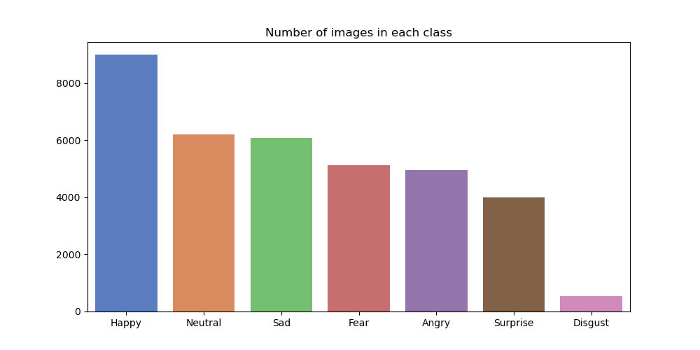
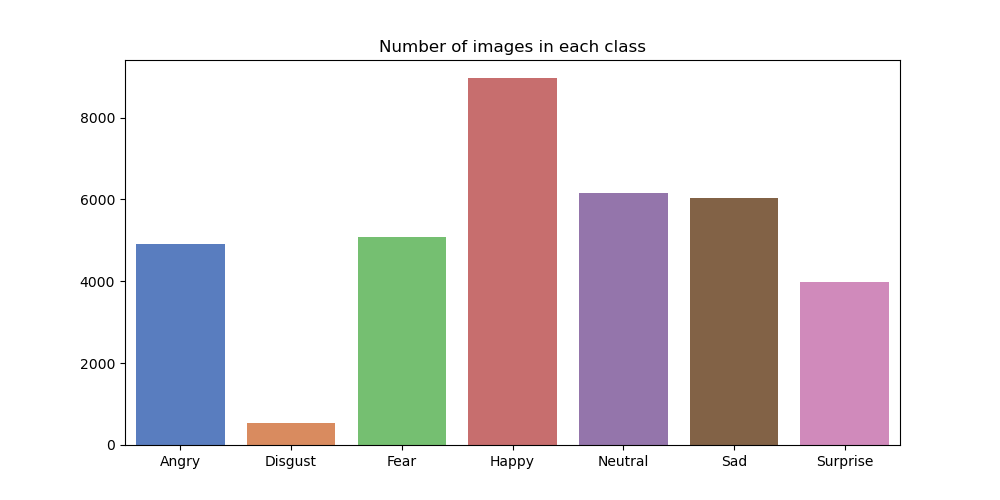

# Facial-Expression-Recognition

> Aryan Garg   


## Compute Used:

GPU 0: NVIDIA GeForce RTX 3090     

GPU 1: NVIDIA GeForce GTX 1080 Ti 

## Usage/Flow:

1. Go through eda.ipynb for a comprehensive exploratory data analysis with dataset cleaning as well.

2. Go through baselines.ipynb or jump to [Results](#results-accuracy) directly in this report. `models/fast_baselines.py` also saves a submission csv for the test set. Please find the `submissions` directory to evaluate the methods.

3. Go through `scratch.ipynb` to train & test our custom models. **Note** that you will need to enter your Weights and Biases key OR comment out all logging even in the core Lightning Module (not recommended)

4. Go through `ensemble.ipynb` for better results (Work in Progress)

5. ToDo: Experiment with different augmentations (use albumentations)

   
(Run Notebooks directly. No need to run any script explicitly)


---       

# Dataset class distribution:  

## Original:

'Happy': 8989,    
'Neutral': 6198,    
'Sad': 6077,    
'Fear': 5121,    
'Angry': 4953,    
'Surprise': 4002,    
'Disgust': 547    
   


## (Somewhat) Cleaned dataset:

'Angry': 4905,    
'Disgust': 535,    
'Fear': 5078,    
'Happy': 8957,   
'Neutral': 6151,    
'Sad': 6042,    
'Surprise': 3974    



---
# Custom Model Summaries:

1. Custom Convolutional Neural Net:

> Note: The input is a 224 x 224 x 3 (stacked thrice) image to stay consistent with the fine-tuned models

```

----------------------------------------------------------------
        Layer (type)               Output Shape         Param #
================================================================
            Conv2d-1         [-1, 16, 224, 224]             448
              ReLU-2         [-1, 16, 224, 224]               0
         MaxPool2d-3         [-1, 16, 112, 112]               0
            Conv2d-4         [-1, 32, 112, 112]           4,640
              ReLU-5         [-1, 32, 112, 112]               0
         MaxPool2d-6           [-1, 32, 56, 56]               0
            Conv2d-7           [-1, 64, 56, 56]          18,496
              ReLU-8           [-1, 64, 56, 56]               0
         MaxPool2d-9           [-1, 64, 28, 28]               0
           Linear-10                 [-1, 1024]      51,381,248
             ReLU-11                 [-1, 1024]               0
           Linear-12                  [-1, 512]         524,800
             ReLU-13                  [-1, 512]               0
           Linear-14                    [-1, 7]           3,591
          Softmax-15                    [-1, 7]               0
================================================================
Total params: 51,933,223
Trainable params: 51,933,223
Non-trainable params: 0
----------------------------------------------------------------
Input size (MB): 0.57
Forward/backward pass size (MB): 24.14
Params size (MB): 198.11
Estimated Total Size (MB): 222.82
----------------------------------------------------------------

```

2. Custom Fully Connected Neural Net (MLP):

> Note: The input is a 224 x 224 x 3 (stacked thrice) image to stay consistent with the fine-tuned models

```
----------------------------------------------------------------
        Layer (type)               Output Shape         Param #
================================================================
           Flatten-1               [-1, 150528]               0
            Linear-2                 [-1, 1024]     154,141,696
              ReLU-3                 [-1, 1024]               0
            Linear-4                    [-1, 7]           7,175
================================================================
Total params: 154,148,871
Trainable params: 154,148,871
Non-trainable params: 0
----------------------------------------------------------------
Input size (MB): 0.57
Forward/backward pass size (MB): 1.16
Params size (MB): 588.03
Estimated Total Size (MB): 589.77
----------------------------------------------------------------
```

---

### Results (Accuracy):

| Models               | Accuracy (%) | Epochs |
|----------------------|--------------|--------|
| ResNet34             | 55.84        | 50     |
| ResNet50             | 58.21        | 50     |
| ResNet101            | 61.43        | 50     |
| Visformer_small      | 66.59        | 50     |
| vit_base_patch16_224 | 68.58        | 50     |
| vit_base_r50_s16_224 | 70.14        | 50     |
| Scratch_CNN(ours)    | 50           | 7      |
| Scratch FC-NN(ours)  | 43.75        | 10     |
| VGG16                | -            | -      |
| VGG19                | -            | -      |

---   

### Our Models (CNN & FC-NN) Plots ( from wandb <3 ):


---   

### Ensembling results: (WIP)
