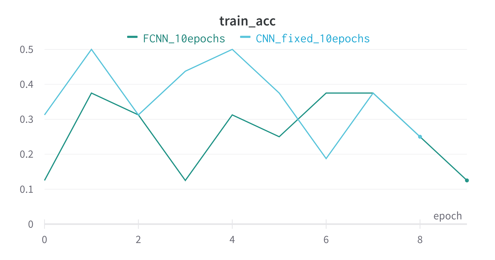
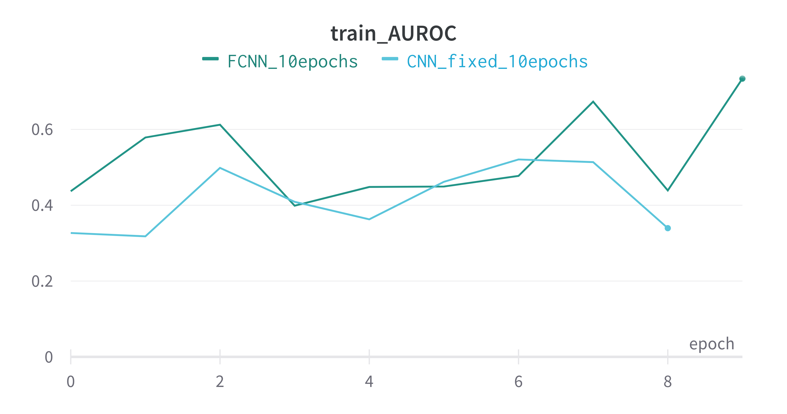
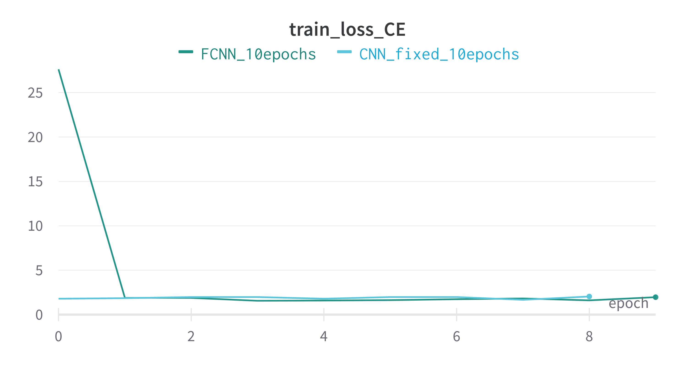
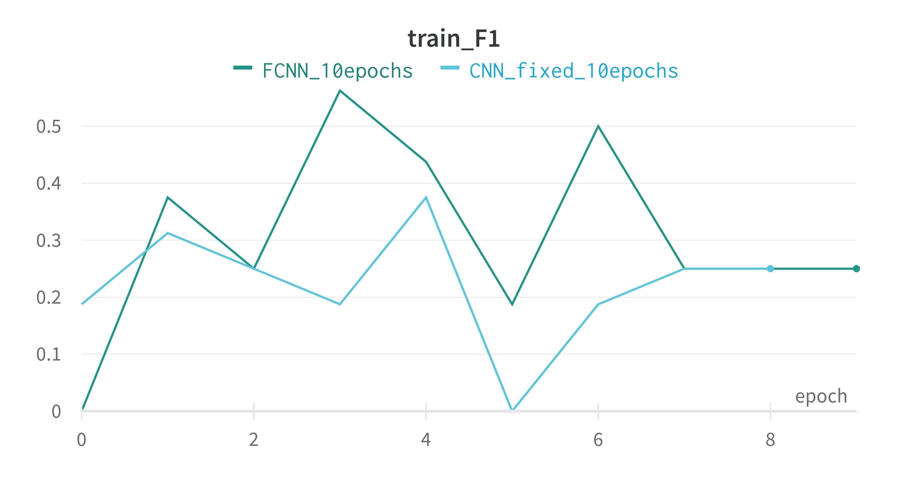

# Facial-Expression-Recognition

> Aryan Garg   

## Set-Up:

GPU 0: NVIDIA GeForce RTX 3090
GPU 1: NVIDIA GeForce GTX 1080 Ti 

## Usage:

Run Notebooks directly. No need to run any script explicitly.

---       

### Results (Accuracy):

| Models               | Accuracy (%) | Epochs |
|----------------------|--------------|--------|
| ResNet34             | 55.84        | 50     |
| ResNet50             | 58.21        | 50     |
| ResNet101            | 61.43        | 50     |
| Visformer_small      | 66.59        | 50     |
| vit_base_patch16_224 | 68.58        | 50     |
| vit_base_r50_s16_224 | 70.14        | 50     |
| Scratch_CNN(ours)    | 50           | 7      |
| Scratch FC-NN(ours)  | 43.75        | 10     |
| VGG16                | -            | -      |
| VGG19                | -            | -      |

---   

### Our Models (CNN & FC-NN) Plots ( from wandb <3 ):

---   

### Ensembling results: (WIP)